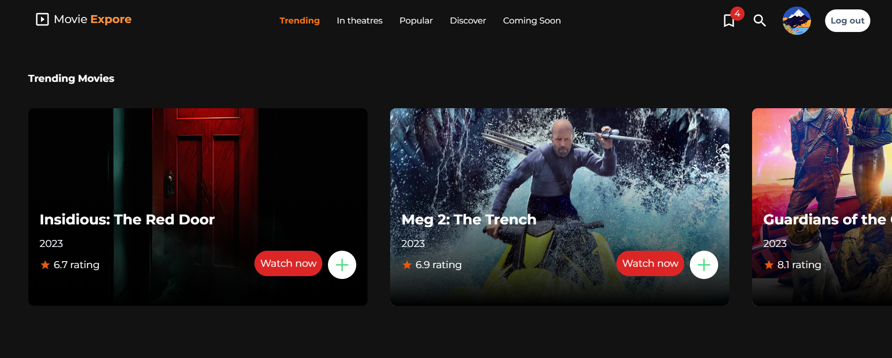
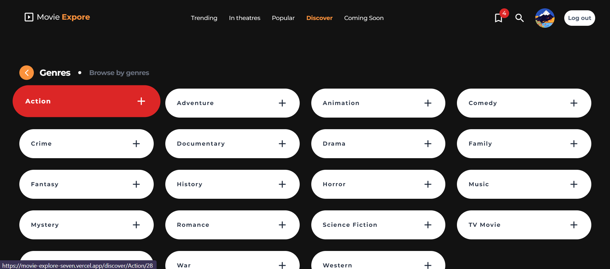
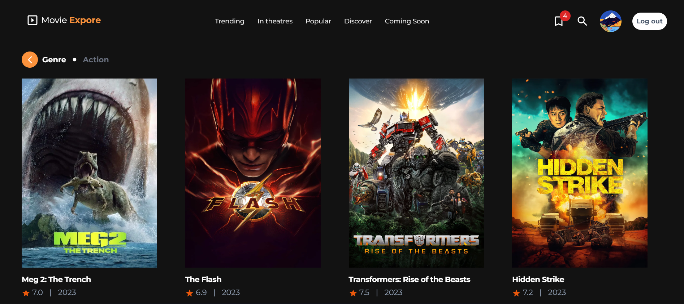
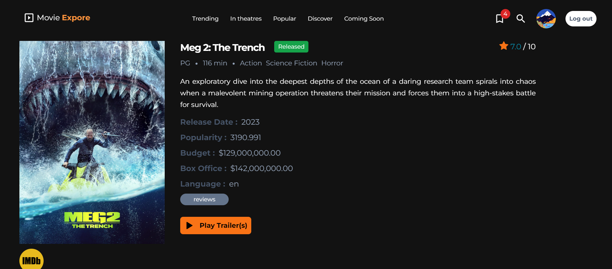
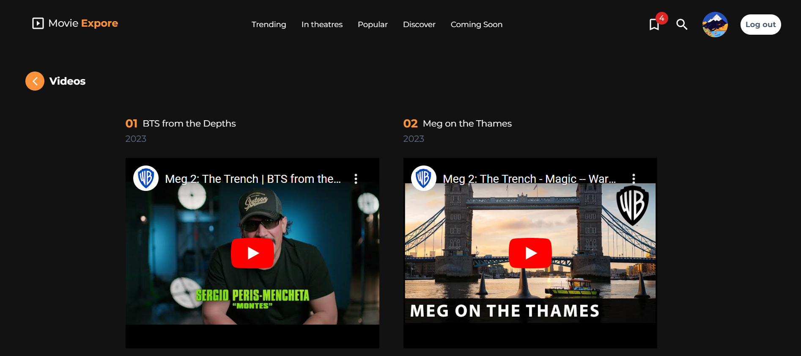

<a name="readme-top"></a>

<!-- PROJECT LOGO -->
<br />
<div align="center">

<h2 align="center">MOVIE-Explore</h2>
  <p align="center">
   Get Latest and Trending Movies, also customize your movie profile and mark movies watched, add latest and trending movie, add movies to watch list and customize your library.
  </p>
</div>

<!-- TABLE OF CONTENTS -->
<details>
  <summary>Table of Contents</summary>
  <ol>
    <li><a href="#tech-stack">Tech Stack</a></li>
    <li><a href="#development">Development</a></li>
  </ol>
</details>
<br/>

<div align="center">
  <a href="https://github.com/Tk-brainCodes/Movie-Explore
">
    
       
          
   
   

  </a>
</div>
<br/>

<!-- TECH STACK -->

## Tech Stack

- **Next 13** with Typescript
- Styled using **TailwindCSS**
- Authentication, database using **Firebase**
- State management using **Redux and Context-API**
- Testing using **Cypress**

<p align="right">(<a href="#readme-top">back to top</a>)</p>

<!-- DEVELOPMENT -->

## Development

<br/>

1. Clone the repository

```sh
git clone https://github.com/Tk-brainCodes/Movie-Explore.git
```

2. cd into the `youtube-app` directory

```sh
cd youtube-app/
```

3. Install dependencies using npm

```sh
npm install
```

4. Copy your `firebase config` into `.env-local` and update the variables

5. Start the development server

```sh
npm run dev
```

<p align="right">(<a href="#readme-top">back to top</a>)</p>
